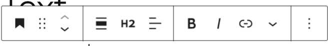
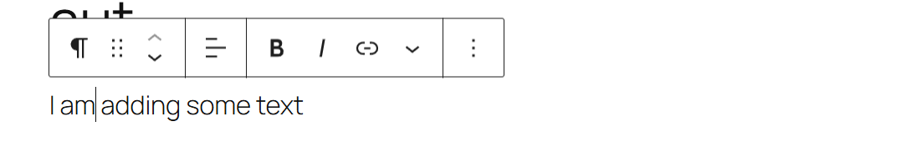

*NB: 'Blocks' in this document refer to UI elements in the content canvas that will be converted to JSON blocks*

# Block types

- Editors will be able choose from an array of UI block types form the left-hand block palette.
- Blocks will be grouped by type
- Blocks can be added either by selecting from the block palette or directly in the canvas by pressing /
  - Pressing / allows the editor to start to type the block name or they can press a + button that opens an inline modal list of blocks
- 

## 1. Text

1. Paragraph
   - Available properties:
     - Size
     - Alignment
       - Centre, left, right
     - Weight
       - bold, light, normal
     - Italic
       - default is no
     - Add link
       - select to add URL
       - check box to open in new tab
    - Underline
      - Default is no
   - Properties can be edited in the properties pane or with an inline properties picker that appears above the block
   - 
   - 

2. Heading
   - Available properties:
     - H1, H2, H3...
     - Alignment
       - Centre, left, right
     - Weight
       - bold, light, normal
     - Italic
       - default is no
     - Add link
       - select to add URL
       - check box to open in new tab
3. Numberered list
4. Bulleted list
5. Code
   - Embed code sample for copying
     - Available properties
       - Language
       - Number lines
         - Default is yes
       - Copy code to clipboard
6. Detail

## Media

1. Image
   - Options to add are browse media library, upload, Url
   - Alt text
   - Caption
2. Gallery
3. Audio
   - Options to add are browse media library, upload, Url
   - Alt text
   - Controls
     - Play
     - Pause
     - skip forward 15s
     - Skip back 15s
     - See transcript
       - Toggle for edit to all or disable transcripts
     - Download
       - Toggle for editor to allow or disable download
4. Video
   - Options to add are browse media library, upload, Url
   - Alt text
   - Controls
     - Full screen (esp to exit)
     - Theatre-mode
     - Play
     - Pause
     - skip forward 15s
     - Skip back 15s
     - See transcript
       - Toggle for edit to all or disable transcripts
     - Download
       - Toggle for editor to allow or disable download
5. Image and text
   - Two column layout
   - Options to add are browse media library, upload, Url
   - Alt text
   - Caption
   - Image left and text right 
     - toggle to switch columns
6. Cover - out of scope for version 1
   - Options to add are browse media library, upload, Url
   - Alt text
7. File
   - Options to add are browse media library, upload, Url
   - Displays a link to download a file

## Design

1. Accordion
2. Buttons
3. Columns
4. Group
5. Row
6. Stack
7. Grid
8. Separator
9. Spacer
